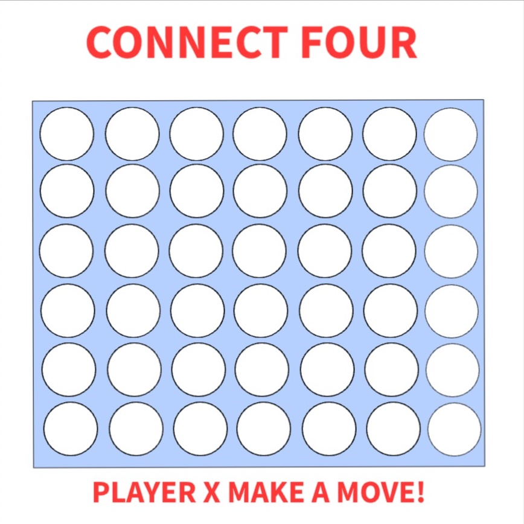

# Ronne's Connect Four

### My game choice for project 1 will be Connect Four. I will be building this and customizing it to my liking. 

## Wireframe 




## PsuedoCode
```
FUNCTIONS

function initialize() {
This function will:
-set the player turn
}

function loadGameboard() {
This function will:
-create the game board itself
-add the event listener to the gameboard itself so that a player can click and make a move
}

function makeMove() {
-retrieve all circles on gameboard
-use ID of clicked circles to check if its a valid move 
    ie: was the circle selected on top of another? was the circle selected already taken?
-ability to switch turns between player 1 and player 2
}

function checkForWinner() {
-use the ID of clicked circles
-compare ID and loop over all winning condition arrays
-display whether player 1 or player 2 won
}

function restartGame() {
-this function will restart the gameboard after player 1 or 2 has won
}

